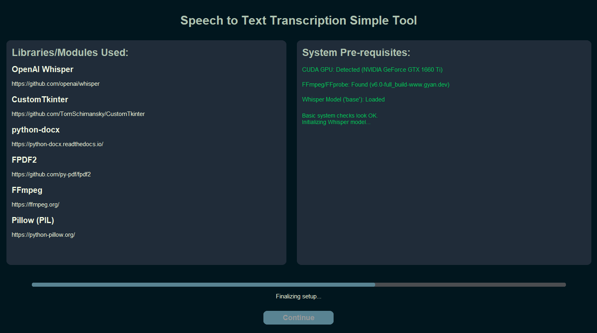
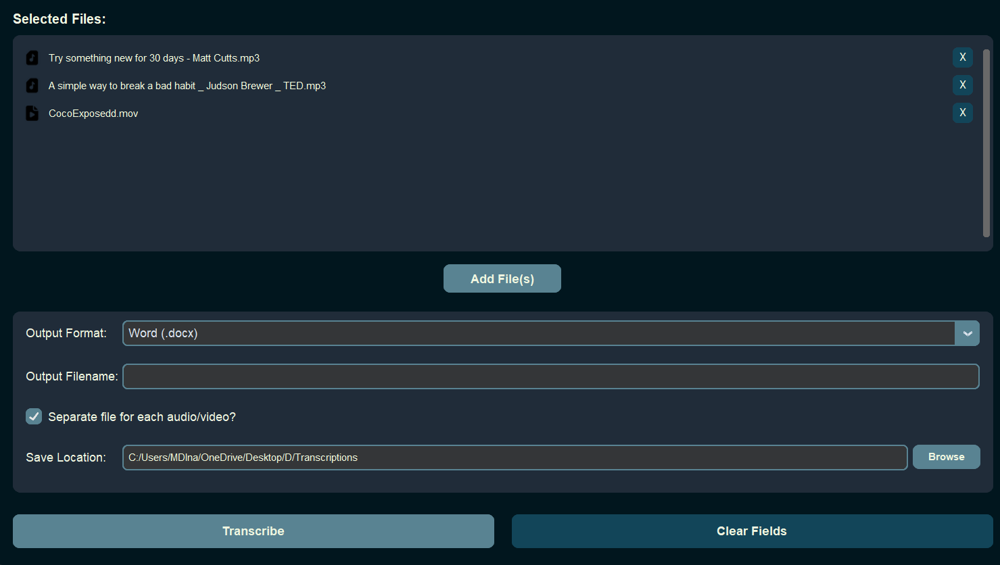
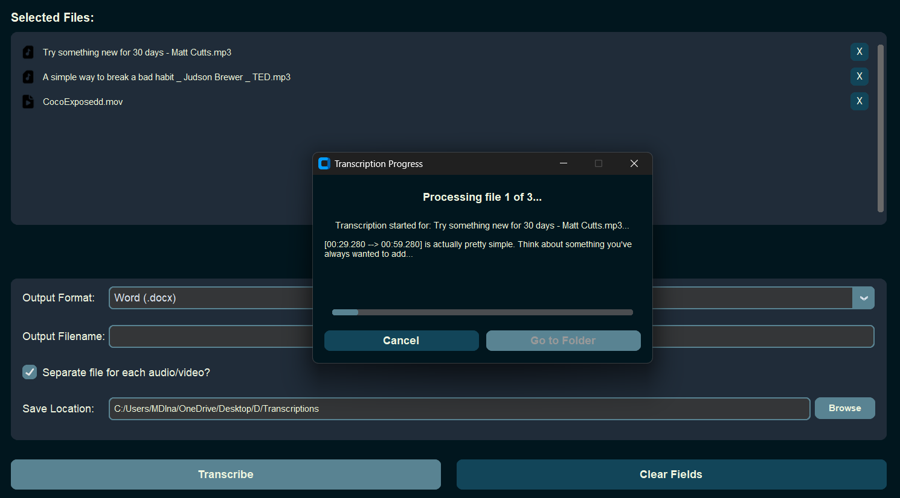

# Speech To Text - Python Desktop Tool

A simple Python desktop application built with CustomTkinter to transcribe audio and video files into text documents (.docx or .pdf) using OpenAI's Whisper model.

## Screenshots

Below are some screenshots of the application in action:

**Loading Screen (with System Pre-requisite Checks):**

**Main Home Screen (File Selection & Output Configuration):**

**Transcription Progress Popup:**

## Overview

This tool provides an easy-to-use graphical interface for transcribing speech from various media formats. It leverages the power of OpenAI's Whisper for accurate transcription and offers flexibility in output formats and file handling. The application prioritizes using GPU (NVIDIA CUDA) for faster processing and includes a pre-flight system check on the loading screen.

## Features

- **User-Friendly Interface:** Built with CustomTkinter for a modern look and feel.
- **Multiple File Selection:** Select and transcribe multiple audio or video files in one go.
- **Broad Format Support:** Supports common audio (MP3, WAV, M4A, FLAC, OGG, AAC) and video (MP4, MKV, MOV, AVI, FLV, WMV) formats, dependent on FFmpeg/FFprobe for duration analysis and Whisper's internal FFmpeg for audio extraction.
- **GPU Accelerated Transcription:** Utilizes NVIDIA CUDA-enabled GPUs via PyTorch and Whisper for significantly faster transcriptions.
- **System Pre-requisite Checks:** The loading screen checks for:
  - CUDA GPU availability.
  - FFmpeg/FFprobe presence (for media duration analysis).
  - Successful Whisper model loading.
- **Flexible Output Options:**
  - Save transcriptions as **Microsoft Word (.docx)** or **PDF (.pdf)** files.
  - Option to save each transcription in a **separate file** (named after the original media file).
  - Option to **combine all transcriptions** into a single output file with a user-defined name.
- **Custom Output Location:** Users can browse and select their desired folder for saving transcriptions.
- **Real-time Progress Display:**
  - A dedicated popup window shows transcription progress.
  - Displays current file being processed (e.g., "File 2 of 5").
  - Shows a snippet of the currently transcribed segment (truncated for UI neatness).
  - Features a progress bar that updates based on the processed duration of segments within each file.
- **Cancellable Process:** Users can cancel an ongoing transcription batch.
- **Informative Loading Screen:** Displays key libraries/modules used and initializes the transcription engine.

## Core Technologies & Libraries Used

- **Python 3.x**
- **OpenAI Whisper:** For the core speech-to-text transcription.
- **CustomTkinter:** For the graphical user interface.
- **PyTorch:** As a backend for Whisper, enabling CUDA GPU acceleration.
- **FFmpeg/FFprobe (External Dependency):** Used to get media file durations for accurate progress estimation. _Users may need to install this separately and ensure it's in their system PATH for optimal progress display._
- **python-docx:** For creating and saving `.docx` files.
- **fpdf2:** For creating and saving `.pdf` files.
- **Pillow (PIL):** For handling icons and images in the UI.
- **Standard Libraries:** `os`, `sys`, `io`, `threading`, `re`, `time`, `unicodedata`, `tkinter`.

## How It Works (User Workflow)

1.  **Launch Application:** The user starts the application.
2.  **Loading Screen:**
    - The application initializes, displaying a loading screen.
    - System pre-requisites (CUDA, FFmpeg, Whisper model) are checked and their status is displayed.
    - The Whisper AI model is loaded.
    - The user clicks "Continue" once loading is complete (or "Exit" if critical checks fail).
3.  **Home Screen - Configuration:**
    - **Add Files:** The user clicks "Add File(s)" to open a file dialog, select media files. The list of selected files (with icons) is displayed, and files can be removed.
    - **Set Output Format:** Choose between "Word (.docx)" or "PDF (.pdf)".
    - **Set Output Filename:** If not creating separate files, the user provides a base name for the combined output file.
    - **Separate Files Option:** The user can check a box to create a separate transcription document for each input file.
    - **Select Save Location:** The user chooses a directory where the transcribed files will be saved.
4.  **Start Transcription:**
    - The user clicks the "Transcribe" button.
    - A popup window appears, showing the transcription progress.
5.  **Transcription Process & Progress:**
    - The popup displays which file is currently being processed and the overall progress.
    - A progress bar updates based on the processed segments.
    - Snippets of the live transcription are shown.
    - The user can cancel the process at any time.
6.  **Output Generation:**
    - Once transcription is complete (or cancelled), the generated text is saved to the specified location in the chosen format(s).
7.  **Completion:**
    - The popup indicates completion, failure, or cancellation.
    - The user can choose to open the output folder or close the popup.

## Prerequisites

- **NVIDIA GPU with CUDA support:** Required for GPU-accelerated transcription. The application will check for this. If not available, the application will indicate an error on the loading screen as it's configured to strictly use CUDA.
- **FFmpeg and FFprobe:** While Whisper has its own FFmpeg dependency for audio processing, this tool also uses `ffprobe` (which comes with FFmpeg) to determine media durations for better progress bar accuracy.
  - It's highly recommended that users have FFmpeg installed and that `ffprobe` (and `ffmpeg`) are accessible via their system's PATH.
  - If not found, the application will still attempt to run, but progress estimation for files may be less accurate or fall back to per-file updates. The loading screen will show a warning.
- _(Python 3.8+ would typically be listed here if running from source, along with instructions to install packages from `requirements.txt`)_

## License

This project is licensed under the **MIT License**. (You will need to create a `LICENSE` file in your project root containing the actual MIT license text).

---
